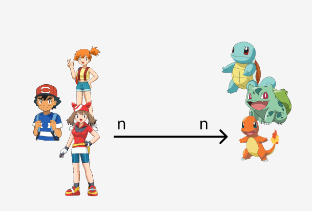

<h1 align="center"; style="color:">FOREIGN KEY (chave estrangeira)
    
</h1> 

##  Introduction

<strong>Foreign key</strong> é uma column em uma table que referencia a primary key de outra table.

É através dela que conseguimos fazer uma conexão entre tables.


Uma table pode ter várias foreign keys. Ou seja, uma table pode se relacionar com várias tables.


:warning: Você só vai conseguir criar uma table com **foreign key** se a table que você 
vai referenciar existir. Se não, vai dar erro. As duas tables precisam existir.

<br>
<hr>


## Syntax:

Assim como qualquer outra constraint (**UNIQUE**, **PRIMARY KEY**, etc...) , podemos adicionar uma constraint assim que criamos a table.


A criação da constriant vai ser a mesma. A única diferenca é que precisamos referenciar a table que vamos fazer a conexao e o campo com a primary key dessa table.


É como se tivéssemos copiando o campo de uma table para outra table.

<br>

```sql
CONSTRAINT fk_name FOREIGN KEY (column) REFERENCES table_da_primary_key (column_da_primary_key);
```

<br>

Primeiro referenciamos a table e dentro dos **()** a column com a primary key.

A syntax é igualzinha a criacao de uma constraint qualquer.

<br>
<hr>


## Existes 3 tipos de relação entre tables

As tables podem se relacionar de 3 formas:

- **Many To Many**
- **One To Many**
- **One To One**

<br>
<hr>

## Many To Many

Aqui, vários pessoas podem ter vários pokemons. Vários pokemons podem ser de qualquer pessoa.




Quando temos uma relação de **Many to Many** (ninguem é de ninguem), nós sempre vamos ter 3 tables:

- **table A** --> table pokemon
- **table B** --> table treinador
- **table associacao** --> Aqui que vamos colocar as foreign keys. Essa e a table para saber quantos pokemons tem cada pessoa.


<br>

### Criando as tables

#### table treinador
``` sql
CREATE TABLE IF NOT EXISTS tb_treinador(
    id BIGSERIAL CONSTRAINT PK_treinador PRIMARY KEY,
    name VARCHAR(80) NOT NULL
);
```

:pencil2: Crie 3 treinadores

``` sql
INSERT INTO tb_treinador
    (name)
VALUES
    ('Ashe'),
    ('Equipe Rocket'),
    ('Ruan');
```

<br>

#### table pokemon

```sql
CREATE TABLE IF NOT EXISTS tb_pokemon(
    id BIGSERIAL CONSTRAINT PK_pokemon PRIMARY KEY,
    name VARCHAR(49) NOT NULL,
    power VARCHAR(49) NOT NULL
);
```

:pencil2: Crie 2 pokemons

```sql
INSERT INTO tb_pokemon
    (name, power)
VALUES
    ('pikachu', 'trovao'),
    ('squirtle', 'agua');
```

Pronto. Agora é só criar a table de associacao para relacionar essas 2 tables.

<br>

#### association table

Essa é a table que vamos usar para relacinoar essas 2 tables (**tb_treinador** e **tb_pokemon**). Com ela, conseguimos responder:
- Tal pokemon foi escolhido por quantos treinadores?
- Tal treinador tem quantos pokemons?

Quando estamos trabalhando com uma relação **Many-to-Many**, nós criamos uma **association table**. Essa association table possui apenas 2 campos:

- **Campo1** --> Foreign key fazendo referencia a table1
- **Campo2** --> Foreign key fazendo referencia a table2

⚠️ Essa **association table** NÃO precisa ter um campo com primary key. Esses dois campos bastam. A primary key dessa table será a combinação desses 2 campos. Assim, não poderá ser inserido uma combinacao desses 2 campos iguais. Ex:

Se voce colocar "ashe" + "picachu".... Nao dá pra colocar esses 2 campos juntos novamente. 

A primary key faz com que um campo seja unico. QUando colocamos 2 campos na primary key, estamos dizendo que nao vai existir uma combinacao igual desses 2 campos, sacou?


```sql
CREATE TABLE IF NOT EXISTS tb_treinador_pokemon(
    treinador_id INTEGER NOT NULL,
    pokemon_id INTEGER NOT NULL,

    -- CONSTRAINTS
    CONSTRAINT PK_treinador_pokemon PRIMARY KEY (treinador_id, pokemon_id), --A primary key dessa table é a combinacao desses 2 campos. Assim, garantimos que a combinacao nao sera repetida. Ou seja, o 'Ashe' nao pode ter o 'picachu' novamente.
    CONSTRAINT FK_treinador FOREIGN KEY (treinador_id) REFERENCES tb_treinador (id),
    CONSTRAINT FK_pokemon FOREIGN KEY (pokemon_id) REFERENCES tb_pokemon (id)
);
```


:pencil2: Agora sim, coloque o 'pikachu' para todos os treinadores.

```sql
INSERT INTO tb_treinador_pokemon
VALUES
    (1,1), -- Ashe e Pikachu
    (2,1), -- Equip rocket e Pikachu
    (3,1); -- Joaozin e Pikachu
```

💡 Viu?? Se voce tentar inserir novamente esses mesmos dados voce nao vai conseguir. Isso, porque essa combinacao ja foi inserida.

Se ligou???? **Many to Many**

- Vários treinadores possuem o pikachu....
- Pikachu possui varios treinadores....

<br>

- Varios treinadores podem ter qualquer pokemon
- Varios pokemons podem ser de qualquer treinador


<br>

:pencil2: Adicione todos os pokemons ao 'ashe'. Depois, faça uma query e diga quantos pokemons têm cada treinador:

```sql
SELECT
    tp.treinador_id,
    COUNT(tp.treinador_id) "Quant. de pokemons"
FROM
    tb_treinador_pokemon tp
GROUP BY
    tp.treinador_id
ORDER BY
    COUNT(tp.treinador_id) DESC;
```

:pencil2: Faça uma query e diga quantos treinadores cada pokemon possui:

```sql
SELECT
    tp.pokemon_id,
    COUNT(tp.treinador_id) "Quant. Treinadores"
FROM
    tb_treinador_pokemon tp
GROUP BY
    tp.pokemon_id
ORDER BY
    COUNT(tp.treinador_id) DESC; 
```


<hr>
<br>
<br>

## One to Many

<!-- Next Page Button -->
<a href="https://github.com/lGabrielDev/06.postgreSQL/blob/main/2.praticando/20.join.md">
    
</a>


